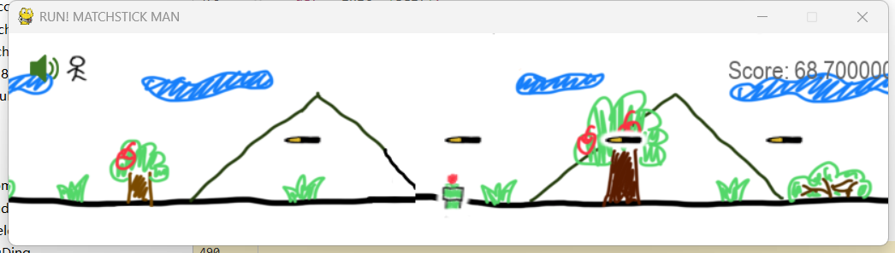

# RUN! MATCHSTICK MAN

 <!-- Optional: Add a screenshot of your game -->

## Description
**RUN! MATCHSTICK MAN** is an interactive game developed using Python and Pygame. The game features a stickman character (Marie) who must navigate through obstacles while learning to make optimal decisions using Q-learning, a reinforcement learning algorithm. The project demonstrates the integration of multimedia elements (audio and images) and generates visual outputs stored in the `result_pic` folder.

## Features
- **Interactive Gameplay**: Control Marie to jump over obstacles and reach the finish line.
- **Q-learning AI**: Marie learns to make decisions (e.g., jump, move left/right) using a Q-learning algorithm.
- **Dynamic Obstacles**: Randomly generated obstacles (missiles and pipes) with varying speeds.
- **Multimedia Integration**: Background music, sound effects, and visual feedback.
- **Visualization**: Real-time plotting of Q-learning metrics (e.g., average reward, exploration rate).

## Requirements
To run this project, you need the following dependencies:
- Python 3.x
- Pygame (`pip install pygame`)
- NumPy (`pip install numpy`)
- Matplotlib (`pip install matplotlib`)

## Installation
1. Clone the repository:
   ```bash
   git clone https://github.com/your-username/your-repo-name.git
2.  Navigate to the project directory: 
    ```bash
    cd your-repo-name
3. Install the required dependencies:  
    ```bash
    pip install -r requirements.txt
## Usage
1. Run the main script to start the game: 
    ```bash
    python marie.py
    
2. Follow the on-screen instructions to interact with the game.

3. The game will display real-time Q-learning metrics and save visualizations in the result_pic folder.

## Folder Structure
```bash
your-repo-name/
├── audio/                  # Audio files used in the game
│   ├── bg_music.wav        # Background music
│   ├── bump.wav            # Collision sound effect
│   ├── jump.wav            # Jump sound effect
│   ├── score.wav           # Score sound effect
│   └── win.wav             # Win sound effect
├── image/                  # Image files used in the game
│   ├── adventure1.png      # Marie sprite 1
│   ├── adventure2.png      # Marie sprite 2
│   ├── adventure3.png      # Marie sprite 3
│   ├── bg.png              # Background image
│   ├── btn_close.png       # Music button (closed)
│   ├── btn_open.png        # Music button (open)
│   ├── gameover.png        # Game over screen
│   ├── missile.png         # Missile obstacle
│   ├── pipe.png            # Pipe obstacle
│   ├── win.png             # Win screen
│   └── 0.png - 9.png       # Score digits
├── result_pic/             # Output images generated by the game
├── marie.py                # Main game script
├── test.py                 # Test script for debugging and modifications
├── README.md               # Project documentation
├── requirements.txt        # List of dependencies
└── .gitignore              # Files and folders to ignore
```

##  Q-learning Implementation

The game uses Q-learning to train Marie to make optimal decisions. Key parameters include:

1. Learning Rate (alpha): Controls how quickly the agent learns.

2. Discount Factor (gamma): Determines the importance of future rewards.

3. Exploration Rate (epsilon): Balances exploration and exploitation.


The Q-learning algorithm updates the Q-table based on the following formula:

```bash
Q[state][action] += alpha * (reward + gamma * np.max(Q[new_state]) - Q[state][action])
```
## Visualization

The game includes real-time visualization of Q-learning metrics:

1. __Average Reward:__ Tracks the average reward per episode.

2. __Average Q-value:__ Tracks the average Q-value per episode.

3. __Exploration Rate (epsilon):__ Tracks the decay of the exploration rate.

4. __Success Count:__ Tracks the number of successful episodes.

## Contributing
Contributions are welcome! Please follow these steps:

1. Fork the repository.

2. Create a new branch __(git checkout -b feature/YourFeatureName)__.

3. Commit your changes __(git commit -m 'Add some feature')__.

4. Push to the branch __(git push origin feature/YourFeatureName)__.

5. Open a pull request.

## License
This project is licensed under the MIT License. See the [LICENSE](LICENSE) file for details.

## Acknowledgments
__Pygame__: For providing the game development framework.

__NumPy__: For numerical computations.

__Matplotlib__: For data visualization.

__Contact__: For questions or feedback, please contact:

Email: siri020501@outlook.com

GitHub: siribabe

